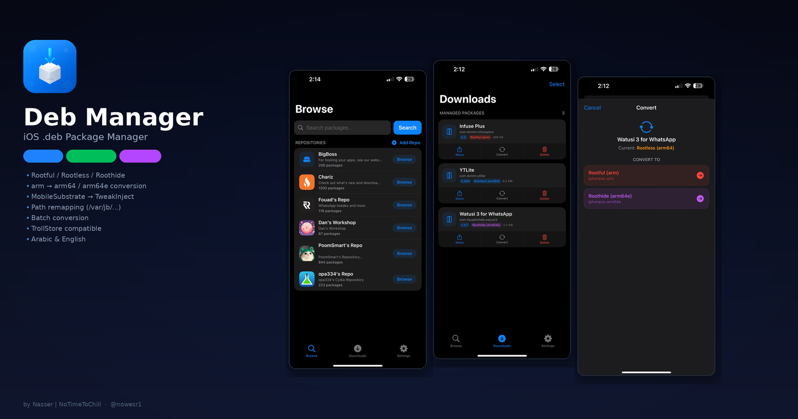
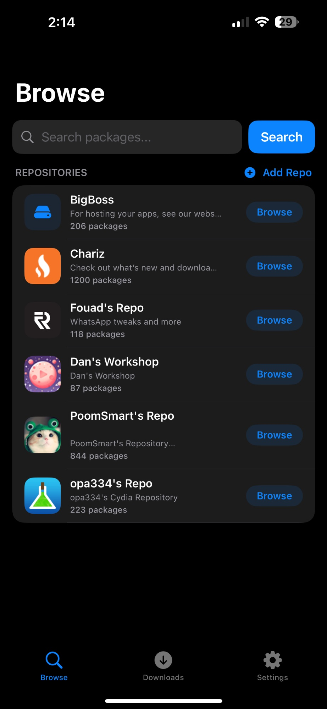
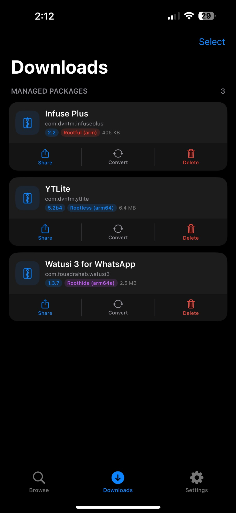
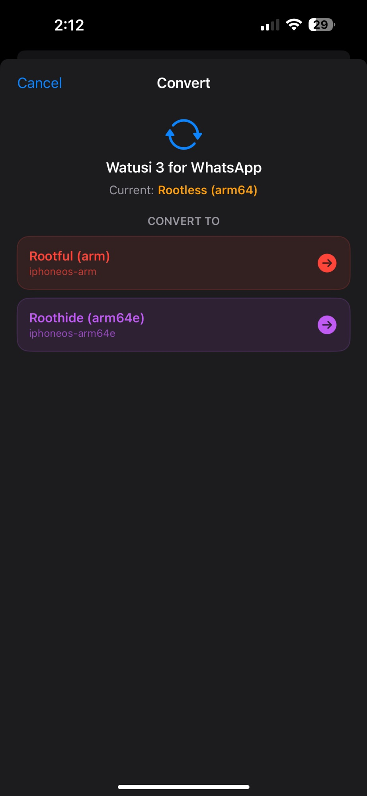

<div align="center">
  
  
  # Deb Manager
  
  ### مدير حزم .deb لنظام iOS
  ### iOS .deb Package Manager
  
  [](https://apple.com)
  [](https://github.com/opa334/TrollStore)
  [](LICENSE)
  [](https://swift.org)
  
</div>

---

<div dir="rtl">

## 🇸🇦 عربي

### الوصف

**Deb Manager** هو تطبيق iOS مبني بـ SwiftUI لإدارة حزم `.deb` (تويكات الجيلبريك). يتيح لك تصفح المستودعات، تحميل الحزم، وتحويلها بين معماريات مختلفة — كل ذلك من جهازك مباشرة.

### المميزات

#### 📦 تصفح المستودعات
- أضف أي مستودع Cydia/Sileo يدوياً
- تصفح جميع الحزم داخل كل مستودع
- البحث عن التويكات بالاسم
- ترتيب أبجدي تلقائي
- عرض أيقونة المستودع واسمه ووصفه

#### ⬇️ التحميل والإدارة
- تحميل ملفات `.deb` مباشرة من المستودعات
- عرض معلومات الحزمة (الاسم، الإصدار، المعمارية، الحجم)
- مشاركة الملفات عبر قائمة المشاركة
- حذف الحزم المحملة

#### 🔄 تحويل المعمارية
تحويل بين ثلاث معماريات:

| المعمارية | النوع | المسار |
|:-:|:-:|:-:|
| `iphoneos-arm` | Rootful (كلاسيكي) | `/Library/MobileSubstrate/` |
| `iphoneos-arm64` | Rootless (Dopamine) | `/var/jb/usr/lib/TweakInject/` |
| `iphoneos-arm64e` | Roothide | `/var/jb/usr/lib/TweakInject/` |

**تفاصيل التحويل (arm → arm64/arm64e):**
- نقل جميع المجلدات تحت مسار `/var/jb/`
- تحويل `MobileSubstrate/DynamicLibraries` → `usr/lib/TweakInject`
- تحديث الروابط الرمزية (Symlinks)
- تحديث ملف `control` (المعمارية)
- تحديث سكربتات DEBIAN
- توقيع الملفات التنفيذية بـ `ldid` (إن وُجد)
- تحويل مجمّع (عدة حزم دفعة واحدة)

#### 🌐 متعدد اللغات
- العربية والإنجليزية
- يتبع لغة الجهاز تلقائياً
- دعم كامل للاتجاه من اليمين لليسار (RTL)

### طريقة البناء

#### المتطلبات
- Xcode 15+
- [XcodeGen](https://github.com/yonaskolb/XcodeGen) (اختياري)
- iOS 15.0+ SDK

#### الخطوات

</div>

```bash
# استنساخ المشروع
git clone https://github.com/nowesr1/DebManager.git
cd DebManager

# إنشاء مشروع Xcode (يتطلب XcodeGen)
xcodegen generate

# أو افتح المشروع مباشرة في Xcode
open DebManager.xcodeproj
```

<div dir="rtl">

1. افتح المشروع في Xcode
2. اختر `DebManager` كـ scheme
3. غيّر الـ target إلى جهازك أو `Any iOS Device`
4. اضغط `Archive` من قائمة `Product`
5. انسخ ملف `.app` من المجلد `Products`
6. أعد تسميته إلى `.tipa` لتثبيته عبر TrollStore

#### التثبيت عبر TrollStore
1. انقل ملف `.tipa` إلى جهازك
2. افتحه بـ TrollStore
3. اضغط "Install"

### لقطات الشاشة

</div>

<div align="center">
  
  
  
</div>

---

## 🇬🇧 English

### Description

**Deb Manager** is a native iOS app built with SwiftUI for managing `.deb` packages (jailbreak tweaks). Browse repos, download packages, and convert between architectures — all from your device.

### Features

#### 📦 Repository Browsing
- Add any Cydia/Sileo repository manually
- Browse all packages within each repo
- Search tweaks by name
- Automatic alphabetical sorting
- Displays repo icon, name, and description

#### ⬇️ Download & Manage
- Download `.deb` files directly from repos
- View package info (name, version, architecture, size)
- Share files via share sheet
- Delete downloaded packages

#### 🔄 Architecture Conversion
Convert between three architectures:

| Architecture | Type | Path |
|:--:|:--:|:--:|
| `iphoneos-arm` | Rootful (Classic) | `/Library/MobileSubstrate/` |
| `iphoneos-arm64` | Rootless (Dopamine) | `/var/jb/usr/lib/TweakInject/` |
| `iphoneos-arm64e` | Roothide | `/var/jb/usr/lib/TweakInject/` |

**Conversion details (arm → arm64/arm64e):**
- Moves all system directories under `/var/jb/` prefix
- Renames `MobileSubstrate/DynamicLibraries` → `usr/lib/TweakInject`
- Updates symbolic links to new paths
- Updates `control` file (Architecture field)
- Updates DEBIAN scripts with new paths
- Signs binaries with `ldid` (if available)
- Batch conversion (multiple packages at once)

**How it works:**
- **With `dpkg-deb`** (jailbroken device): Full extract → remap → repack with zstd (same as RootHidePatcher)
- **Without `dpkg-deb`** (TrollStore only): In-memory tar header modification for `.tar.gz` packages, architecture-only change for `.tar.xz`

#### 🌐 Localization
- Arabic and English
- Follows device language automatically
- Full RTL support

### Building

#### Requirements
- Xcode 15+
- [XcodeGen](https://github.com/yonaskolb/XcodeGen) (optional)
- iOS 15.0+ SDK

#### Steps

```bash
# Clone
git clone https://github.com/nowesr1/DebManager.git
cd DebManager

# Generate Xcode project (requires XcodeGen)
xcodegen generate

# Or open directly in Xcode
open DebManager.xcodeproj
```

1. Open project in Xcode
2. Select `DebManager` scheme
3. Set target to your device or `Any iOS Device`
4. Go to `Product` → `Archive`
5. Copy `.app` from `Products` folder
6. Rename to `.tipa` for TrollStore installation

#### TrollStore Installation
1. Transfer `.tipa` file to your device
2. Open with TrollStore
3. Tap "Install"

### Screenshots

<div align="center">
  
  
  
</div>

---

### Project Structure

```
DebManager/
├── App/            → App entry point, TabView
├── Views/          → SwiftUI views (Browse, Downloads, Settings)
├── Models/         → Data models (Package, Repo)
├── Services/       → Network, Download, Repo, DebConverter
└── Resources/      → Localization (en/ar), Assets, Info.plist
```

### Architecture Mapping Reference

```
Rootful → Rootless/Roothide:
  /Library/MobileSubstrate/DynamicLibraries/  →  /var/jb/usr/lib/TweakInject/
  /Library/PreferenceBundles/                 →  /var/jb/Library/PreferenceBundles/
  /Library/PreferenceLoader/                  →  /var/jb/Library/PreferenceLoader/
  /usr/lib/                                   →  /var/jb/usr/lib/
  /etc/                                       →  /var/jb/etc/
  /Applications/                              →  /var/jb/Applications/

Rootless/Roothide → Rootful:
  /var/jb/usr/lib/TweakInject/    →  /Library/MobileSubstrate/DynamicLibraries/
  /var/jb/Library/                →  /Library/
  /var/jb/usr/                    →  /usr/
  (reverse of above)
```

### Credits

**Developer:** Nasser | NoTimeToChill ([@nowesr1](https://x.com/nowesr1))


### License

MIT License — see [LICENSE](LICENSE) for details.
